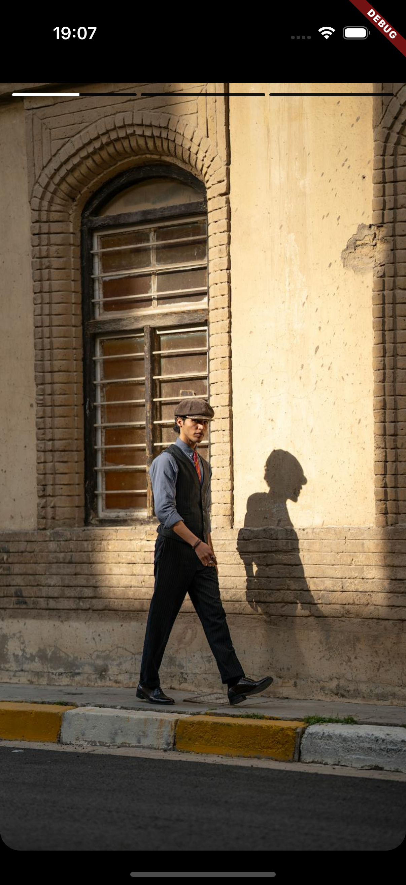
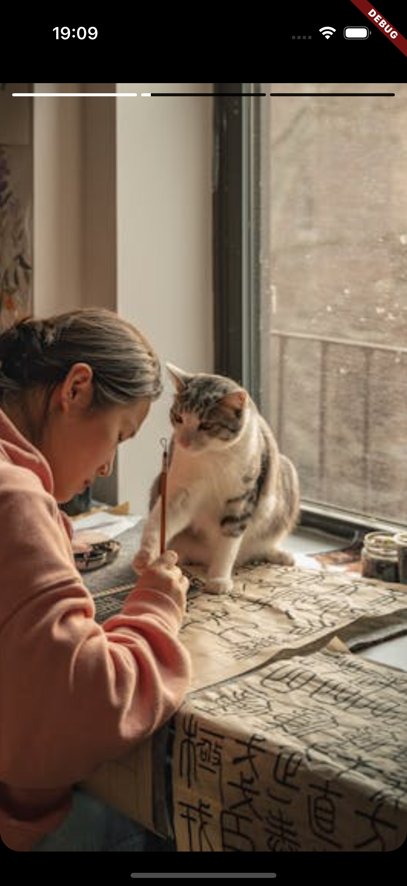

# 📚 StoryKit

A Flutter package for creating Instagram-like stories with customizable progress indicators, durations, and backgrounds.

## ✨ Features

- Display a series of stories with customizable durations.
- Custom progress bar color and background.
- Support for background images and solid color backgrounds.
- Tap to navigate forward or backward between stories.
- Long press to pause and resume stories.
- External control for story index.


## 📸 Screenshots

| Example 1 | Example 2 |
|---|---|
|  |  |

## 📦 Installation

Add this to your package's `pubspec.yaml` file:

```yaml
dependencies:
  storykit: ^0.0.4  # Replace with the latest version
```

Run this command to install the package:

```bash
flutter pub get
```

## 🔄 Import the package

```dart
import 'package:storykit/storykit.dart';
```

## 🚀 Usage

Here's a basic example:

```dart

class StoryScreen extends StatelessWidget {
  final List<Widget> _stories = [
    Container(
      color: Colors.red,
      child: const Center(
        child: Text(
          'Story 1',
          style: TextStyle(color: Colors.white, fontSize: 24),
        ),
      ),
    ),
    Container(
      color: Colors.green,
      child: const Center(
        child: Text(
          'Story 2',
          style: TextStyle(color: Colors.white, fontSize: 24),
        ),
      ),
    ),
    Container(
      color: Colors.blue,
      child: const Center(
        child: Text(
          'Story 3',
          style: TextStyle(color: Colors.white, fontSize: 24),
        ),
      ),
    ),
    Container(
      color: Colors.purple,
      child: const Center(
        child: Text(
          'Story 4',
          style: TextStyle(color: Colors.white, fontSize: 24),
        ),
      ),
    ),
  ];

  StoryScreen({super.key});

  @override
  Widget build(BuildContext context) {
    return StoryKit(
      stories: _stories,
      initialIndex: 0,
      onIndexChange: (index) {},
      durationPerStory: (index) {
        // Custom duration per story if needed
        if (index == 1) {
          return const Duration(seconds: 7); // Story 2 lasts longer
        }
        return const Duration(seconds: 5);
      },
      progressColor: Colors.white,
      progressBackgroundColor: Colors.grey.withOpacity(0.5),
      backgroundImage: Image.network(
        'https://via.placeholder.com/400x800',
        fit: BoxFit.cover,
      ),
      wholeBackgroundColor: Colors.black,
      currentIndex: 0, // Start from the first story
    );
  }
}

```

## 🛠️ Customization

### Progress Indicator Colors

- **progressColor**: Customize the progress bar color.
- **progressBackgroundColor**: Customize the background color of the progress bar.

### Background

- **backgroundImage**: Set a background image for the stories.
- **wholeBackgroundColor**: Set a solid background color.

### Story Durations

- **durationPerStory**: Customize the duration of each story.

## 📌 Callbacks

- **onIndexChange**: Get notified when the story index changes.

## ⚠️ Note

Ensure that the number of stories provided matches the length of any customization lists (like durations).

## 🛠️ API Reference

| Property                      | Type                                 | Description                                                       |
|-------------------------------|--------------------------------------|-------------------------------------------------------------------|
| `stories`                     | `List<Widget>`                       | Required. The list of story widgets to display.                   |
| `initialIndex`                | `int`                                | Optional. The starting index of the story. Default is `0`.        |
| `onIndexChange`               | `Function(int)`                      | Optional. Callback when story index changes.                      |
| `durationPerStory`            | `Duration Function(int)`             | Optional. Set custom duration per story.                          |
| `progressColor`               | `Color`                              | Optional. Customize progress bar color.                           |
| `progressBackgroundColor`     | `Color`                              | Optional. Customize background color of progress bar.             |
| `backgroundImage`             | `Image`                              | Optional. Set a background image for stories.                     |
| `wholeBackgroundColor`        | `Color`                              | Optional. Set a solid background color.                           |
| `currentIndex`                | `int`                                | Optional. Control the current story index programmatically.       |

## 🔗 Links

- [Pub.dev](https://pub.dev/packages/storykit)
- [GitHub Repository](https://github.com/Raks-Javac/storykit)
- [Issue Tracker](https://github.com/Raks-Javac/storykit/issues)

## 📄 License

This project is licensed under the MIT License - see the [LICENSE](LICENSE) file for details.


